# TP1DPBO2526C1

# TP1 DPBO - Sistem Manajemen Tingkatan Kelas Tempat Duduk dalam Bioskop

# Janji

Saya Faiz Muhammad Ghazali dengan NIM 2504531 mengerjakan TP 1 dalam mata kuliah Desain dan Pemrograman Berorientasi Objek untuk keberkahanNya maka saya tidak melakukan kecurangan seperti yang telah dispesifikasikan. Aamiin.

# Desain Program

Program menggunakan konsep OOP (Class dan Enkapsulasi) pada 4 bahasa pemrograman (Java, C++, Python, dan PHP) dengan list of objects. Semua atribut pada kelas bersifat private/protected dan hanya bisa diakses lewat getter dan setter.

Atribut pada kelas `KelasBioskop` terdiri dari:

| No | Atribut | Keterangan | Tipe Data |
|----|---------|------------|-----------|
| 1 | `id` | ID Tingkatan Kelas (unik) | String |
| 2 | `namaKelas` | Nama dari Tingkatan Kelas tersebut (contoh: IMAX, Deluxe) | String |
| 3 | `jumlahKursi` | Jumlah kursi pada Tingkatan Kelas tersebut | Integer |
| 4 | `harga` | Harga tiket dari Tingkatan Kelas tersebut (Rupiah) | Double/Float |

*Catatan: pada Python, penamaan atribut menggunakan* snake_case *(`_id`, `_nama_kelas`, `_jumlah_kursi`, `_harga`).*

Setiap kelas memiliki:

* **Constructor** untuk mengisi semua atribut sekaligus (pada Java tersedia juga constructor kosong; pada Python dan PHP semua parameter memiliki nilai *default*).
* **Getter** untuk membaca atribut: `getId`, `getNamaKelas`, `getJumlahKursi`, `getHarga`.
* **Setter** untuk mengubah atribut: `setId`, `setNamaKelas`, `setJumlahKursi`, `setHarga`.

Data awal yang otomatis tersedia saat program dijalankan:

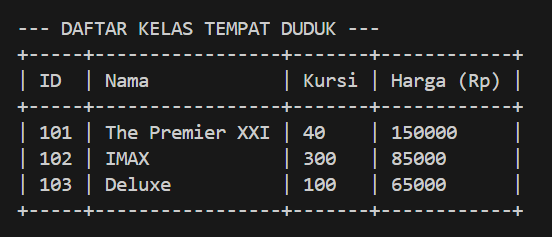

Data disimpan dalam *list of objects* (`ArrayList` pada Java, `list` pada Python, dan *array* di dalam `$_SESSION` pada PHP), sehingga jumlah data tidak dibatasi.

# Alur Program

Program menyediakan 6 pilihan menu utama:

* `[1]` Tambah Data (Menambah objek baru)
* `[2]` Tampilkan Data (Menampilkan semua objek)
* `[3]` Update Data (Mengubah data via ID)
* `[4]` Hapus Data (Menghapus data via ID)
* `[5]` Cari Data (Mencari objek spesifik)
* `[6]` Keluar

1. **Tambah Data Kelas**: User memasukkan ID, nama kelas, harga tiket, dan jumlah kursi. Validasi dilakukan pada program utama dengan aturan berikut:
   * **ID**: tidak boleh kosong dan tidak boleh sama dengan ID yang sudah terdaftar.

   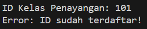

   * **Nama Kelas**: tidak boleh kosong.

   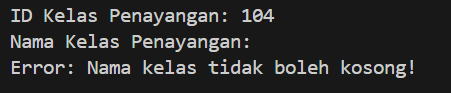

   * **Harga Tiket**: harus berupa angka dan lebih dari 0 (nilai $\le 0$ ditolak).

   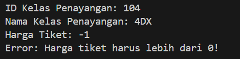

   * **Jumlah Kursi**: harus berupa bilangan bulat dan tidak boleh negatif.

   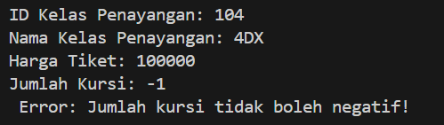

   Jika semua validasi lolos, objek `KelasBioskop` baru dibuat dan ditambahkan ke list. Jika ada yang tidak valid, program menampilkan pesan error dan data tidak disimpan.

2. **Tampilkan Data**: Program melakukan perulangan (*looping*) pada list untuk menampilkan seluruh kelas yang tersimpan dalam bentuk tabel (ID, Nama, Kursi, Harga). Pada versi konsol, lebar tabel menyesuaikan isi data terpanjang secara dinamis. Jika list kosong, ditampilkan pesan bahwa belum ada data.

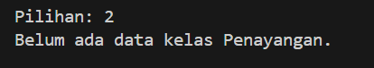

3. **Update Data**: User memasukkan ID kelas target. Jika ID ditemukan, user memasukkan nama, jumlah kursi, dan harga yang baru, lalu data diperbarui lewat *setter*. Nilai baru divalidasi terlebih dahulu (nama tidak boleh kosong, kursi tidak boleh negatif, harga harus lebih dari 0). ID tidak dapat diubah. Jika ID tidak ditemukan, ditampilkan pesan error.

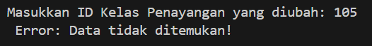

4. **Hapus Data**: User memasukkan ID kelas target. Jika ID ditemukan, objek dihapus dari list (`remove` pada Java, `pop` pada Python, `array_splice` pada PHP) sehingga elemen setelahnya otomatis bergeser dan data tetap rapat. Jika ID tidak ditemukan, ditampilkan pesan error.

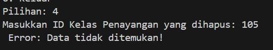

5. **Cari Data**: User memasukkan ID kelas target. Jika ID cocok, program menampilkan detail kelas tersebut dalam bentuk tabel. Pencarian menggunakan pencocokan ID yang persis sama.

6. **Keluar**: Menghentikan perulangan menu dan menutup program.

*Catatan Khusus PHP:* Program berjalan di lingkungan web lokal menggunakan form HTML/CSS dan memanfaatkan `$_SESSION` untuk mempertahankan *array of objects* kelas bioskop tanpa database. Pembagian aksinya:

* **Tambah dan Update** menggunakan form `POST`. Tombol **Edit** pada tabel mengisi form dengan data kelas terpilih (kolom ID dikunci) dan mengubah tombol menjadi *Update Kelas*. Tombol **Reset** mengembalikan form ke mode tambah.
* **Hapus** menggunakan parameter `GET` (`?delete=ID`) dengan konfirmasi sebelum data dihapus.
* **Cari** menggunakan form `GET` (`?search=ID`) yang menyaring tabel berdasarkan ID.
* Pesan sukses atau error ditampilkan dalam kotak notifikasi di atas form.

---

# Dokumentasi

## Java

### Tambah Data
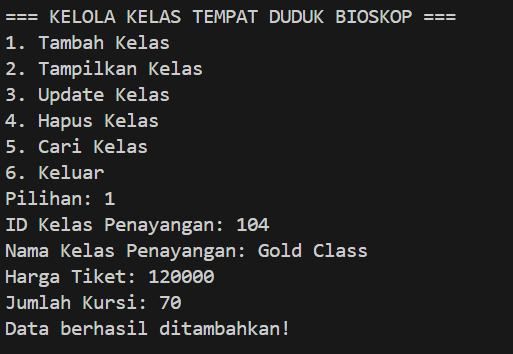

### Tampilkan Data
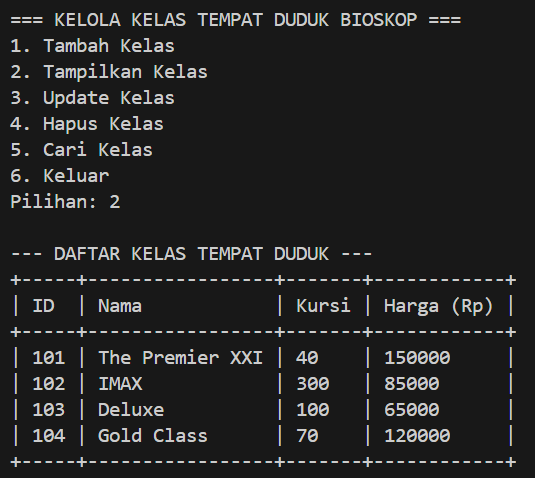

### Update Data
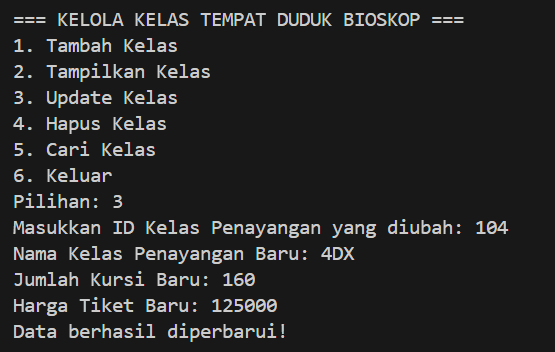

Hasil : 
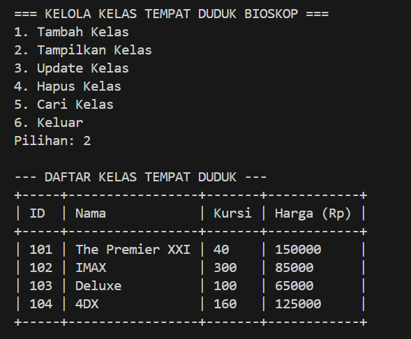

### Hapus Data
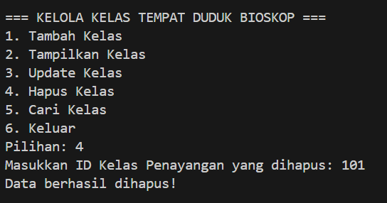

Hasil : 
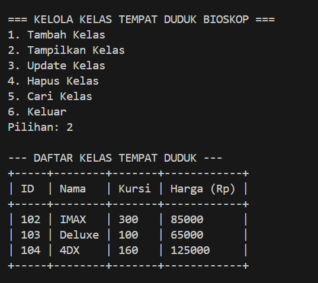

### Cari Data
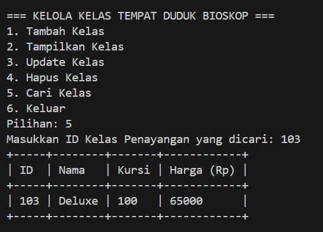

---

## C++

### Tambah Data

### Tampilkan Data
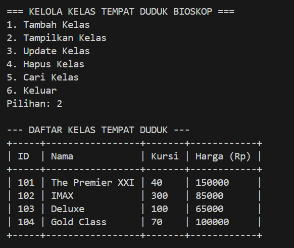

### Update Data
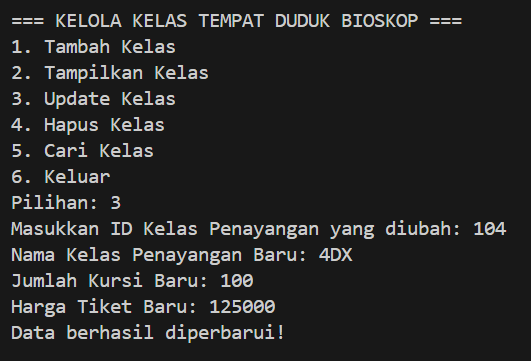

Hasil : 
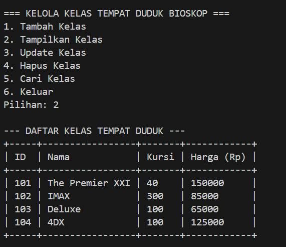

### Hapus Data
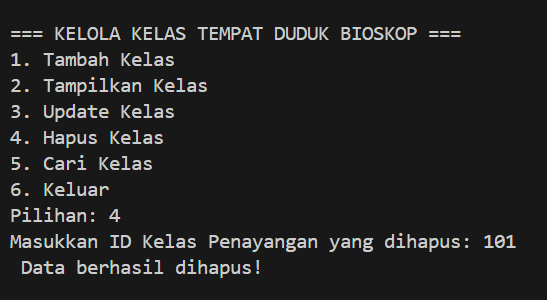

Hasil : 
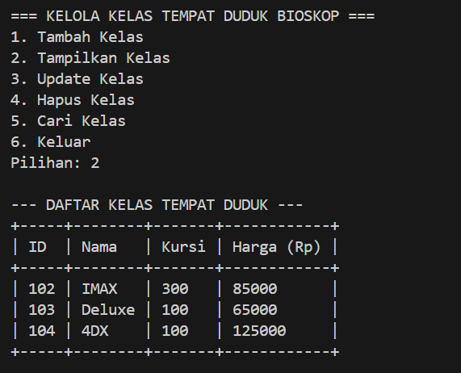

### Cari Data
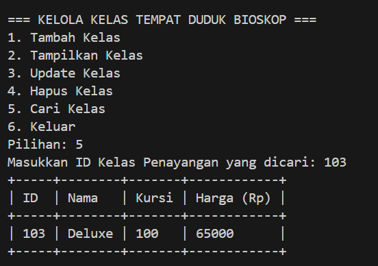

---

## Python

### Tambah Data
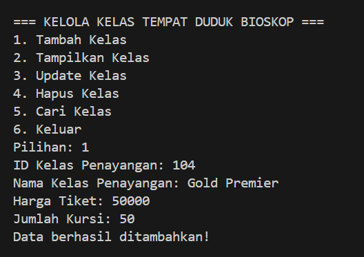

### Tampilkan Data

### Update Data
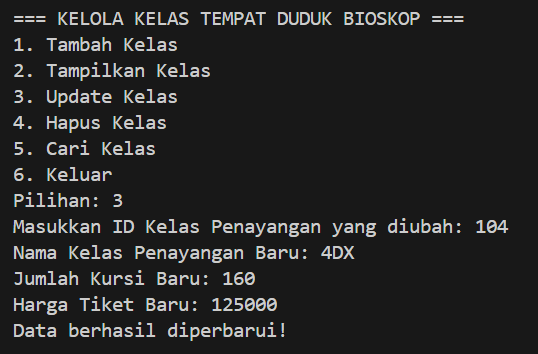

Hasil : 
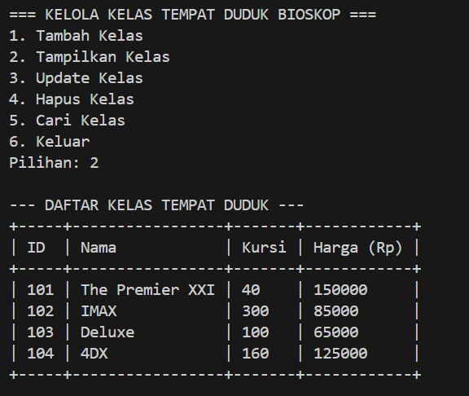

### Hapus Data
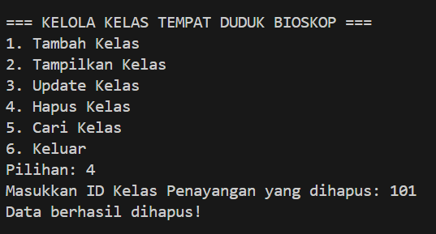

Hasil : 
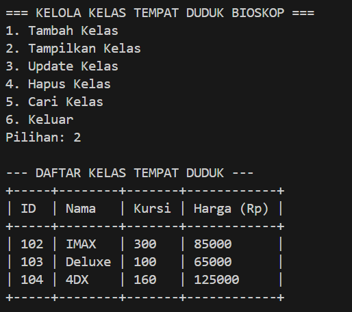

### Cari Data
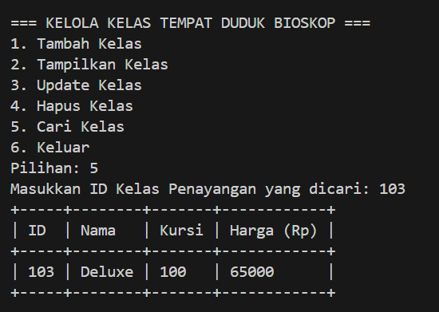

---

## PHP

### Tambah Data
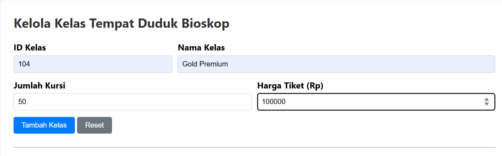

### Tampilkan Data
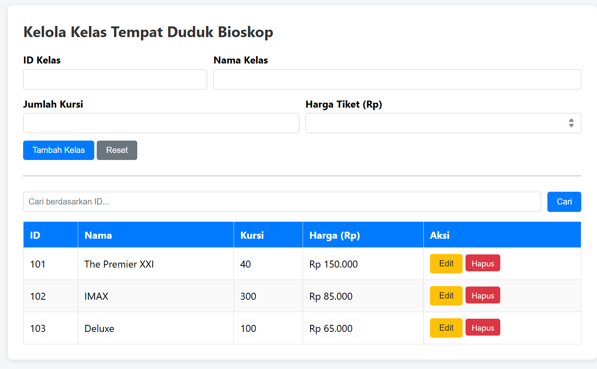

Hasil : 
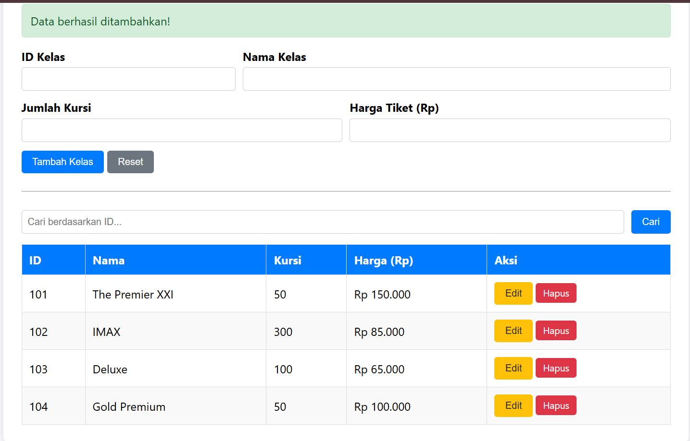

### Update Data
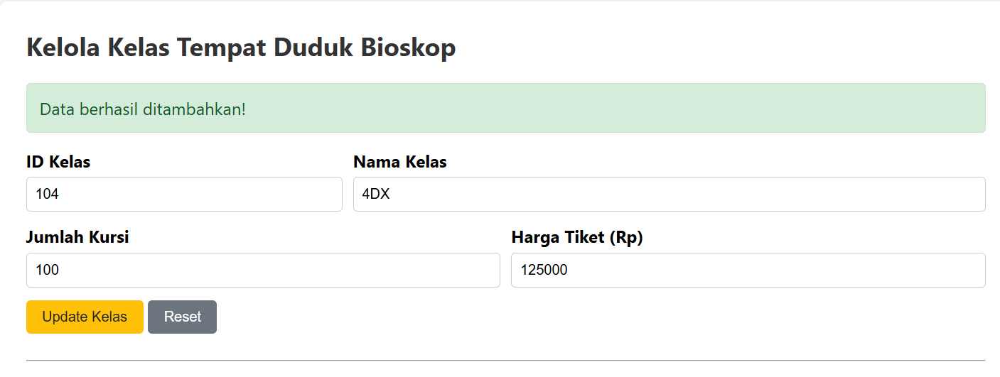

Hasil : 
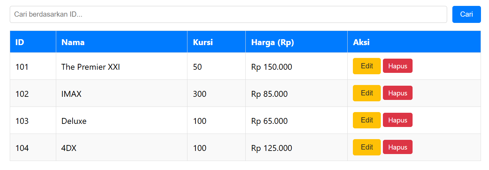

### Hapus Data
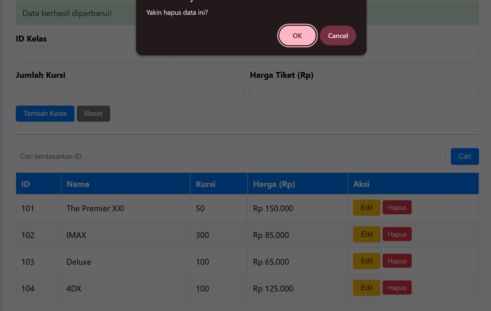

Hasil : 
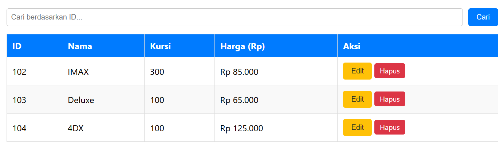

### Cari Data
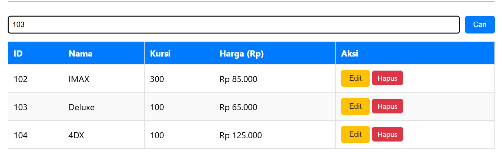

Hasil : 
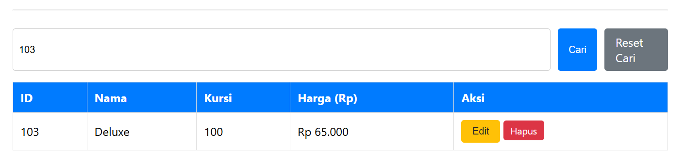

### Beberapa Eror Handling yang dimiliki : 

Jika ID Sudah Terdaftar : 
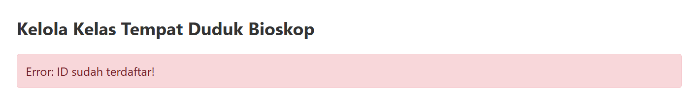

Jika Harga/Kursi Minus : 
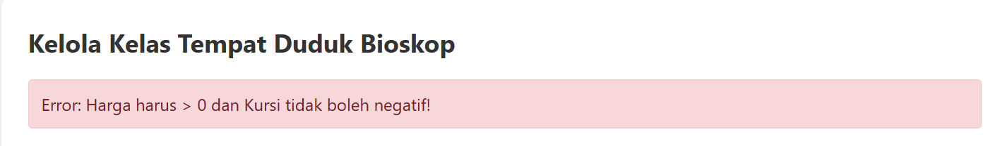

